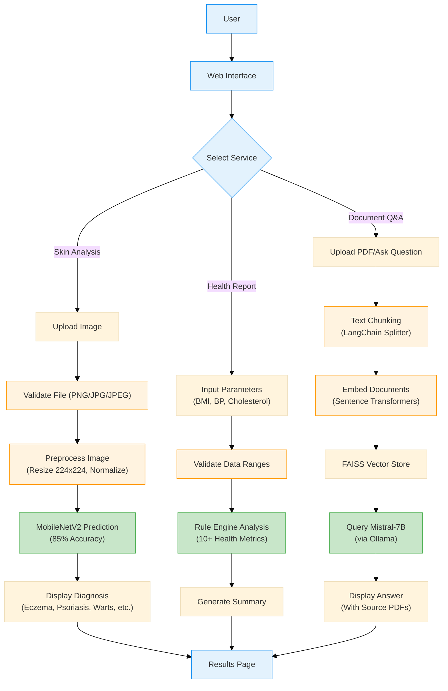

# Health Analysis System with Deep Learning

[](https://github.com/Asish2107/DL-Project/stargazers)
[](https://opensource.org/licenses/MIT)

A comprehensive health analysis system integrating skin condition prediction based on the user provided images, health parameter evaluation, and medical document Q&A using Retrieval-Augmented Generation (RAG).

## Features

### 🩺 Skin Condition Analysis
- MobileNetV2-based image classification
- 85% accuracy on skin conditions of type Eczema, Atopic Dermatitis, Melanocytic Nevi, Psoriasis,Seborrheic Keratoses, Tinea Ringworm Candidiasis and Warts Molluscum.
- Real-time confidence scoring

### 📊 Health Report Generation
- 10+ parameter analysis (BMI, Blood Pressure, Cholesterol, etc.)
- Rule-based health risk assessment
- Personalized recommendations

### 📚 Medical Document Q&A
- RAG system with Mistral-7B LLM
- FAISS vector database for document retrieval
- Source citation(Input PDF Documents) for answers

## Installation

1. Clone repository:
```bash
git clone https://github.com/Asish2107/DL-Project.git
```

2. Install dependencies:

```bash
pip install -r requirements.txt
```

3. Set up Ollama (required for Q&A system):

```bash
ollama serve # Run this in a separate terminal for the continous running of ollama model.
ollama pull mistral # Run this command in new terminal.
```

## Usage

 Start the Flask server:

```bash
python app.py
Access web interface at http://localhost:5001

Use features through web UI:

Skin Analysis: Upload dermatology images(Note - For now this model is trained only on skin diseases of type Eczema, Atopic Dermatitis, Melanocytic Nevi, Psoriasis,Seborrheic Keratoses, Tinea Ringworm Candidiasis and Warts Molluscum)

Health Report: Input health parameters

Document Q&A: Ask any medical related questions.
```

## Project Structure
```bash
DL-Project/
├── data/                  # Source documents for RAG system
├── notebook/              # EDA performed on different skin conditions data set
├── src/
│   ├── components/        # Health report rules engine & Skin condition model training.
│   └── exception.py       # Exception Handling
│   └── logger.py          # Log Handling
├── templates/             # Flask HTML templates
├── app.py                 # Main application entry point
├── predict_pipeline.py    # Skin condition prediction pipeline
├── rag_system.py          # RAG system with Mistral-7B LLM
└── requirements.txt       # Dependency list
```

## Technologies Used
```bash
1. Core ML:

TensorFlow 2.12.0 

MobileNetV2 (ImageNet weights)

NumPy/Pandas/ScikitLearn (Data processing)

2. NLP & Embeddings:

Ollama (Mistral-7B)

LangChain

Sentence-Transformers (all-MiniLM-L6-v2)

3. Web Framework:

Flask 2.3.2

Werkzeug (Secure file handling)

4. Utilities:

FAISS (Vector storage)

HTML
```

## License
Distributed under MIT License. See LICENSE for details.

## Acknowledgements

Ollama for local LLM infrastructure

LangChain for RAG implementation

Sentence Transformers for embeddings

